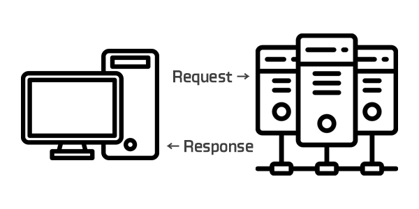
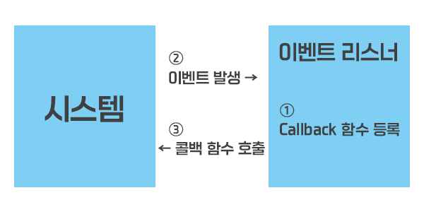

### Node.js(노드)
- Node.js®는 Chrome V8 JavaScript 엔진으로 빌드된 Javascript 런타임입니다.
- 노드는 서버 뿐만 아니라 자바스크립트 프로그램을 실행하는 런타임으로서 사용할 수 있음
- 서버 : 네트워크를 통해 클라이언트에 정보나 서비스를 제공하는 컴퓨터 또는 프로그램
  - 정보나 서비스 데이터가 저장되고 불러올 수 있는 곳
  - 요청(Request) : 웹 사이트 방문할 때 주소를 입력(요청)
  - 응답(Response) : 브라우저에서 해당하는 컴퓨터 위치를 확인하고 웹 사이트 페이지를 받아와 요청자의 브라우저(클라이언트)에 화면을 띄우는 것(응답)
  
- 런타임 : 특정 언어로 만든 프로그램들을 실행할 수 있는 환경
  - 특정 언어로 만든 프로그램을 실행할 수 있는 환경
- 노드는 자바스크립트 프로그램을 실행할 수 있음
  - 구글의 V8 엔진을 사용해 노드 프로젝트를 시작
  - libuv 라이브러리를 통해 이벤트 기반, 논 블로킹 I/O 모델 구현
#### 이벤트 기반(Event-Driven)
- 이벤트가 발생할 때 미리 지정해둔 작업을 수행하는 방식(Event Listener 또는 Callback 함수)

- 이벤트 루프 : 이벤트 발생 시 호출할 Callback 함수들을 관리하고, 호출된 Callback 함수의 실행 순서를 결정하는 역할 담당
  - 노드가 종료될 때까지 이벤트 처리를 위한 작업을 반복하기 때문에 루프(loop)라 부름, 호출 스택을 이용
  ``` Javascript
  funcion first() {
    second();
    console.log("First");
  }
  funcion second() {
    thrid();
    console.log("Second");
  }
  funcion third() {
    console.log("Third");
  }
  first();

  // 호출 스택 : FILO(First In Last Out) 방식
  // 호출 순서 : anonymous -> first() -> second() -> third()
  // 실행 순서 : third() -> second() -> first() -> anonymous
  ```
- 백그라운드 : setTimeout와 같은 타이머나 이벤트 리스너들이 대기하는 다른 언어로 작성된 프로그램으로, 여러 작업이 동시에 실행될 수 있음
- 태스크 큐 : 이벤트 발생 후 백그라운드에서 태스크 큐로 타이머나 이벤트 리스너의 콜백 함수를 보냄, 콜백 큐라고도 부르며 특정한 경우 제외하고 보통 완료된 순서대로 줄을 서 있음

#### 논 블로킹(Non-Blocking) IO
- 이전 작업이 완료될 때까지 대기하지 않고 다음 작업을 수행함  
- 블로킹 : 이전 작업이 끝나야만 다음 작업을 수행할 수 있음
- setTimeout(Callback 함수, 0) : 논 블로킹으로 만들기 위해 사용하는 기법 중 하나의 함수, 밀리초 0은 기본적인 지연 시간이 존재
- 자바 스크립트 코드가 동시에 시작하는 것이 아닌 실행 순서만 바뀌는 것으로, 간단한 작업들이 대기하는 상황을 막을 수 있음

#### 싱글 스레드
- 스레드가 하나뿐인 것을 의미
- 프로세스 : 운영체제에서 할당하는 작업 단위
- 스레드 : 프로세스 내 실행되는 흐름 단위
- 노드는 싱글 스레드, 논 블로킹 방식을 채택하고 있으며, 하나의 스레드가 많은 일을 처리, 대신 멀티 프로세싱 방식을 이용해 많은 I/O 요청 작업을 처리하고 프로그래밍을 비교적 쉽게 할 수 있음

### 서버로서의 노드
- 장점
  - 멀티 스레드 방식보다 프로그래밍이 쉬움
  - 멀티 스레드 방식에 비해 적은 컴퓨터 자원 사용
  - I/O 작업이 많은 서버로 적합
  - 웹 서버가 내장되어 있음
  - 자바스크립트를 사용해 웹 사이트와 서버를 하나의 언어로 작업 가능
  - JSON 형식과 쉽게 호환됨
- 단점
  - 싱글 스레드라서 CPU 코어를 하나만 사용
  - CPU 작업이 많은 서버로는 부적합
  - 하나의 스레드가 멈추지 않게 관리가 필요
  - 서버 규모가 커지면 관리하기 어려움