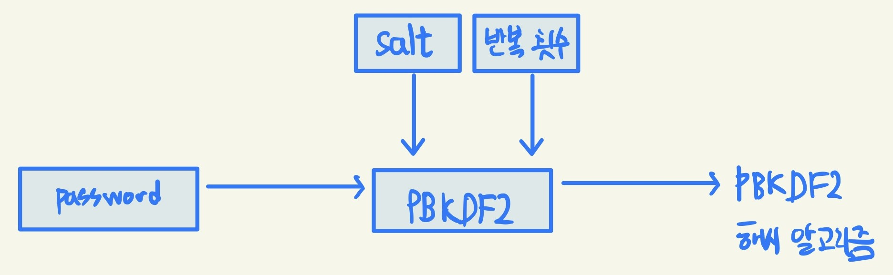

## 노드 기능

### REPL 사용하기
- READ(읽기) / EVAL(해석) / PRINT(반환) / LOOP(반복)
### JS 파일 실행하기
```javascript
function helloWorld() {
    console.log('Hello World');
    helloNode();
}

function helloNode() {
    console.log('Hello Node');
}

helloWorld();
```
```
$ node helloWorld
Hello World
Hello Node
```

### 모듈 만들기
- 모듈 : 특정한 기능을 하는 함수나 변수들의 집합
  - 모듈을 만들어두면 필요한 기능의 코드를 재사용할 수 있음
- ES2015 모듈 : 자체 모듈 시스템 문법
  - require -> import / module.exports -> export default
  - 파일 확장자를 mjs로 바꾸거나 package.json에 type: "module" 속성을 넣어야함
- var.js
```javascript
const odd = '홀수';
const even = '짝수';

// 파일 불러오면 export default(module.exports)에 대입된 값 사용
export default {
    odd,
    even,
};
```

- func.js
```javascript
// const { odd, even } = require('./var');
import { odd, even } from './var.mjs';

function checkOddOrEven(num) {
    if(num % 2) {
        return odd;
    }
    return even;
}

export default checkOddOrEven;
```

- index.js
```javascript
import { odd, even } from './var.mjs';
import checkNumber from './func.mjs';

function checkStringOddOrEven(str) {
    if (str.length % 2) {
        return odd;
    }
    return even;
}

console.log(checkNumber(10));
console.log(checkStringOddOrEven('Hello'));
```

### 노드 내장 객체 알아보기
- global : 브라우저의 window와 같은 전역 객체
  - 모든 파일에서 접근 가능
  - window.open(window.console)을 open(console)으로 호출하는 것 처럼 global도 생략 가능
```javascript
$ node
> global
{
    global: [Circular *1],
    clearInterval: [Function: clearInterval]
    clearTimeout: [Function: clearTimeout]
    ...
}
> global.console
{
    log: [Function: bound consoleCall],
    warn: [Function: bound consoleCall],
    dir: [Function: bound consoleCall],
    ...
}
```

```javascript
import A from './globalA.mjs';

global.message = '안녕하세요';
console.log(A());
```

```javascript
export default () => global.message;
```

```
$ node globalB
안녕하세요
```

- console : 디버깅을 위해 사용
    - console.time(레이블) / console.timeEnd(레이블) : 서로 대응되며, 같은 레이블을 가진 time과 timeEnd 사이 시간 측정
    - console.log(내용) : 로그들을 콘솔에 표시
    - console.error(에러 내용) : 에러를 콘솔에 표시
    - console.table(배열) : 배열 요소로 객체 리터럴을 넣으면 객체 속성들이 테이블 형식으로 표현
    - console.dir(객체, 옵션) : 객체를 콘솔에 표시할 떄 사용
      - 첫 번째 인수 : 표시할 객체
      - 두 번째 인수 : 옵션
        - colors : 경우 true로 할 경우 콘솔에 색이 추가
        - depth : 객체 안의 객체를 몇 단계까지 보여줄 지 결정(기본값 : 2)
    - console.trace(레이블) : 에러가 어디서 발생했는지 추적
```
쉼표로 구분해 여러 값을 찍을 수 있습니다.
abc 1 true
에러 메시지
┌─────────┬────────┬───────┐
│ (index) │  name  │ birth │
├─────────┼────────┼───────┤
│    0    │ '제로' │ 1994  │
│    1    │ 'hero' │ 1998  │
└─────────┴────────┴───────┘
{ outside: { inside: { key: 'value' } } }
{ outside: { inside: [Object] } }
시간 측정: 1.207ms
Trace: 에러 위치 추적
    at b (c:\Users\Laeti\StudyProjects\Node_js-Textbook\Scri
pt\Chapter3\node3_3\console.js:38:13)
    at a (c:\Users\Laeti\StudyProjects\Node_js-Textbook\Scri
pt\Chapter3\node3_3\console.js:41:5)
    at Object.<anonymous> (c:\Users\Laeti\StudyProjects\Node
_js-Textbook\Script\Chapter3\node3_3\console.js:43:1)
    at Module._compile (node:internal/modules/cjs/loader:121
8:14)
    at Module._extensions..js (node:internal/modules/cjs/loa
der:1272:10)
    at Module.load (node:internal/modules/cjs/loader:1081:32
)
    at Module._load (node:internal/modules/cjs/loader:922:12
)
    at Function.executeUserEntryPoint [as runMain] (node:int
ernal/modules/run_main:82:12)
    at node:internal/main/run_main_module:23:47
전체 시간: 10.112ms
```


- 타이머
  - setTimeout(콜백 함수, 밀리초) : 주어진 밀리초 이후에 콜백 함수 실행
  - setInterval(콜백 함수, 밀리초) : 주어진 밀리초마다 콜백 함수 반복 실행
  - setImmediate(콜백 함수) : 콜백 함수 즉시 실행
  - clearTimeout(아이디) : setTimeout을 취소
  - clearInterval(아이디) : setInterval을 취소
  - clearImmediate(아이디) : setImmediate를 취소
```javascript
const timeout = setTimeout(() => {
    console.log('1.5초 후 실행');
}, 1500);

const interval = setInterval(() => {
    console.log('1초마다 실행');
}, 1000);

const timeout2 = setTimeout(() => {
    console.log('실행되지 않습니다.');
}, 3000);

setTimeout(() => {
    clearTimeout(timeout2);
    clearInterval(interval);
}, 2500);

const immediate = setImmediate(() => {
    console.log('즉시 실행');
});

const immediate2 = setImmediate(() => {
    console.log('실행되지 않습니다.');
});

clearImmediate(immediate2);
```

```
즉시 실행
1초마다 실행
1.5초 후 실행
1초마다 실행
```

- __filename, __dirname : 현재 파일명과 파일 경로에 대한 정보 확인 가능
```javascript
console.log(__filename);
console.log(__dirname);
```
```
c:\Users\Laeti\StudyProjects\Node_js-Textbook\Script\Chapter3\node3_4\filename.js
c:\Users\Laeti\StudyProjects\Node_js-Textbook\Script\Chapter3\node3_4
```

- module, exports, require : 모듈을 만드는 객체
    - this 특징
      - 최상위 스코프에 존재하는 this는 module.exports를 가리킴
      - 함수 선언문 내부 this는 global 객체를 가리킴
    ```javascript
    console.log(this);
    console.log(this === module.exports);
    console.log(this === exports);

    function whatIsThis() {
        console.log('function', this === exports, this === global);
    }

    whatIsThis();
    ```
    ```
    {}
    true
    true
    function false true
    ```
    - require
      - cache
        - 파일에 대한 속성이나 모듈 관계 등 cache 정보 확인
        - 한 번 require한 파일은 require.cache에 저장
        - 새로 require할 경우 require.cache의 속성을 제거해야 함
      - main : 노드 실행 시 첫 모듈을 가리킴
      ```javascript
      console.log("require가 가장 위에 올 필요가 없습니다.");
      module.expports = "저를 찾아보세요.";

      require('./var');
      console.log('require.cache입니다.');
      console.log(require.cache);
      console.log('require.main입니다.');
      console.log(require.main === module);
      console.log(require.main.filename);
      ```
      ```
      require가 가장 위에 올 필요가 없습니다.
      require.cache입니다.
      [Object: null prototype] {
        'c:\\Users\\Laeti\\StudyProjects\\Node_js-Textbook\\Script\\Chapter3\\node3_3\\require.js': Module {
            id: '.',
            path: 'c:\\Users\\Laeti\\StudyProjects\\Node_js-Textbook\\Script\\Chapter3\\node3_3',
            exports: {},
            filename: 'c:\\Users\\Laeti\\StudyProjects\\Node_js-Textbook\\Script\\Chapter3\\node3_3\\require.js',
            loaded: false,
            children: [ [Module] ],
            paths: [
            'c:\\Users\\Laeti\\StudyProjects\\Node_js-Textbook\\Script\\Chapter3\\node3_3\\node_modules',
            'c:\\Users\\Laeti\\StudyProjects\\Node_js-Textbook\\Script\\Chapter3\\node_modules',
            'c:\\Users\\Laeti\\StudyProjects\\Node_js-Textbook\\Script\\node_modules',
            'c:\\Users\\Laeti\\StudyProjects\\Node_js-Textbook\\node_modules',
            'c:\\Users\\Laeti\\StudyProjects\\node_modules',
            'c:\\Users\\Laeti\\node_modules',
            'c:\\Users\\node_modules',
            'c:\\node_modules'
            ],
            expports: '저를 찾아보세요.'
        },
        'c:\\Users\\Laeti\\StudyProjects\\Node_js-Textbook\\Script\\Chapter3\\node3_3\\var.js': Module {
            id: 'c:\\Users\\Laeti\\StudyProjects\\Node_js-Textbook\\Script\\Chapter3\\node3_3\\var.js',
            path: 'c:\\Users\\Laeti\\StudyProjects\\Node_js-Textbook\\Script\\Chapter3\\node3_3',
            exports: { odd: '홀수', even: '짝수' },
            filename: 'c:\\Users\\Laeti\\StudyProjects\\Node_js-Textbook\\Script\\Chapter3\\node3_3\\var.js',
            loaded: true,
            children: [],
            paths: [
            'c:\\Users\\Laeti\\StudyProjects\\Node_js-Textbook\\Script\\Chapter3\\node3_3\\node_modules',
            'c:\\Users\\Laeti\\StudyProjects\\Node_js-Textbook\\Script\\Chapter3\\node_modules',
            'c:\\Users\\Laeti\\StudyProjects\\Node_js-Textbook\\Script\\node_modules',
            'c:\\Users\\Laeti\\StudyProjects\\Node_js-Textbook\\node_modules',
            'c:\\Users\\Laeti\\StudyProjects\\node_modules',
            'c:\\Users\\Laeti\\node_modules',
            'c:\\Users\\node_modules',
            'c:\\node_modules'
            ]
        }
      }
      require.main입니다.
      true
      ```
      - 순환 참조가 있을 경우 대상을 빈 객체로 표시
        - dep1.js
        ```javascript
        const dep2 = require('./dep2');
        console.log('require dep2', dep2);
        module.exports = () => {
            console.log('dep2', dep2);
        };
        ```
        - dep2.js
        ```javascript
        const dep1 = require('./dep1');
        console.log('require dep1', dep1);
        module.exports = () => {
        console.log('dep1', dep1);
        };
        ```
        dep-run.js
        ```javascript
        const dep1 = require('./dep1');
        const dep2 = require('./dep2');

        dep1();
        dep2();
        ```
      ```
      require dep1 {}
      require dep2 [Function (anonymous)]
      dep2 [Function (anonymous)]
      dep1 {}
      ```
- process : 현재 실행되고 있는 노드 프로세스에 대한 정보를 담고 있습니다.
process 객체 안에는 다양한 속성이 있는데, 하나씩 REPL에 따라 입력해봅시다.
    - process.version : 설치된 노드 버전 확인
    - process.arch : 프로세서 아키텍처 정보 (arm, ia32 등의 값)
    - process.platform : 운영체제 플랫폼, linux나 darwin, freebsd 등의 값
    - process.pid : 현재 프로세스 아이디, 프로세스 여러 개를 가질 때 구분할 수 있음
    - process.uptime() : 프로세스가 시작된 후 흐른 시간, 초단위로 진행
    - process.exePath : 노드의 경로
    - process.cwd() : 현재 프로세스가 실행되는 위치
    - process.cpuUsage : 현재 cpu 사용량
    
    - process.env : 시스템 환경 변수
    
    - process.nextTick(콜백) : 이벤트 루프가 다른 콜백 함수들보다 nextTick의 콜백 함수를 우선으로 처리하도록 만듦
      - process.nextTick와 Promise를 마이크로태스크(microtask)라 부름
      - 이벤트 루프는 마이크로태스크를 우선하기 때문에 재귀 호출은 다른 콜백 함수들이 실행되지 않을 수 있음
   
    ```javascript
    setImmediate(() => {
        console.log('immediate');
    });
    process.nextTick(() => {
        console.log('nextTick');
    });
    setTimeout(() => {
        console.log('timeout');
    }, 0);
    Promise.resolve().then(() => console.log('promise'));
    ```

    ```
    $ node nextTick
    nextTick
    promise
    timeout
    immediate
    ```

- process.exit(노드 프로세스) : 실행중인 노드 프로세스 종료
```javascript
let i = 1;
setInterval(() => {
    if (i === 5) { // i가 5가 되었을 때 종료
        console.log('종료!');
        process.exit();
    }
    console.log(i);
    i += 1;
}, 1000);
```

### 노드 내장 모듈
- os : 사용자 컴퓨터의 운영체제 정보를 가져옴
  - 운영체제 정보
    - os.arch() : process.arch와 동일, 프로세서 아키텍처 정보 (arm, ia32 등의 값)
    - os.platform() : process.platform과 동일, 운영체제 플랫폼, linux나 darwin, freebsd 등의 값
    - os.type() : 운영체제의 종류
    - os.uptime() : 운영체제 부팅 이후 흐른 시간(초), 노드의 실행 시간
    - os.hostname() : 컴퓨터의 이름
    - os.release() : 운영체제 버전
  - 경로
    - os.homedir() : 홈 디렉터리 경로
    - os.tmpdir() : 임시 파일 저장 경로
  - CPU 정보
    - os.cpus() : 컴퓨터의 코어 정보
    - os.freemem() : 사용 가능한 메모리(RAM)
    - os.totalmem() : 전체 메모리 용량
- path : 폴더와 파일의 경로를 쉽게 조작하도록 도와주는 모듈
  - path.sep : 경로의 구분자, 윈도 : \로 경로 구분, POSIX : /로 경로 구분
  - path.delimiter : 환경 변수의 구분자
  - path.dirname(경로) : 파일이 위치한 폴더 경로
  - path.extname(경로) : 파일의 확장자
  - path.basename(경로, 확장자) : 파일의 이름과 확장자를 표시, 확장자 인수값을 넣을 시 파일 이름만 표시
  - path.parse(경로) : 파일 경로를 root, dir, base, ext, name으로 분리
  - path.format(객체) : path.parse()한 객체를 파일 경로로 합침
  - path.normalize(경로) : /나 \를 실수로 여러번 사용하거나 혼용한 경우 정상적인 경로롤 변환
  - path.isAbsolute(경로) : 파일의 경로가 절대경로인지 상대경로인지를 true나 false로 알림
  - path.relative(기준경로, 비교경로) : 경로를 두 개 넣으면 첫 번째 경로에서 두 번째 경로로 가는 방법을 알려줌
  - path.join(경로, ...) : 여러 인수를 넣으면 하나의 경로로 합침 상대경로인 ..(부모 디렉터리)과 .(현 위치)도 알아서 처리
  - path.resolve(경로, ...) : path.join()과 다르게 절대경로로 인식하여 앞의 경로 무시
    - path.join('/a', '/b'. '/c'); /* 결과 : /a/b/c/ */
    - path.resolve('/a', '/b', 'c'); /* 결과 : /b/c */
- url : 인터넷 주소를 쉽게 조작하도록 도와주는 모듈
  - 노드 버전 7에서 추가된 WHATWG(웹 표준 단체) 방식 url과 예전 노드에서 사용한 방식 url이 존재
  - url.parse(주소) : 주소를 분해, WHATWG 방식과 비교하면 username과 password 대신 auth 속성이 있고, searchParams 대신 query가 있음
  - url.format(객체) : WHATWG 방식 url과 기존 노드의 url을 모두 사용할 수 있음
  ```javascript
    const url = require('url'); // WHATWG 방식 url

    // 기존 방식 url
    const { URL } = url;
    const myURL = new URL('http://www.gilbut.co.kr/book/bookList.aspx?sercate1=001001000#anchor');
    console.log('new URL():', myURL);
    console.log('url.format():', url.format(myURL));
  ```
  ```
  new URL(): URL {
    href: 'http://www.gilbut.co.kr/book/bookList.aspx?sercate1=001001000#anchor',
    origin: 'http://www.gilbut.co.kr',
    protocol: 'http:',
    username: '',
    password: '',
    host: 'www.gilbut.co.kr',
    hostname: 'www.gilbut.co.kr',
    port: '',
    pathname: '/book/bookList.aspx',
    search: '?sercate1=001001000',
    searchParams: URLSearchParams { 'sercate1' => '001001000' },
    hash: '#anchor'
  }
  url.format(): http://www.gilbut.co.kr/book/bookList.aspx?sercate1=001001000#anchor
  ```
  - searchParams 객체 : WHATWG 방식에서 반환되는 객체
    - search는 주소를 통해 데이터 전달할 때 사용, 물음표(?)로 시작해 그 뒤에 키=값 형식으로 데이터 전달, 여러 키인 경우 &로 구분
  ```javascript
  const myURL = new URL('http://www.gilbut.co.kr/?page=3&limit=10&category=nodejs&category=javascript');
  console.log('searchParams:', myURL.searchParams);
  console.log('searchParams.getAll():', myURL.searchParams.getAll('category'));
  console.log('searchParams.get():', myURL.searchParams.get('limit'));
  console.log('searchParams.has():', myURL.searchParams.has('page'));

  console.log('searchParams.keys():', myURL.searchParams.keys());
  console.log('searchParams.values():', myURL.searchParams.values());

  myURL.searchParams.append('filter', 'es3');
  myURL.searchParams.append('filter', 'es5');
  console.log(myURL.searchParams.getAll('filter'));

  myURL.searchParams.set('filter', 'es6');
  console.log(myURL.searchParams.getAll('filter'));

  myURL.searchParams.delete('filter');
  console.log(myURL.searchParams.getAll('filter'));

  console.log('searchParams.toString():', myURL.searchParams.toString());
  myURL.search = myURL.searchParams.toString();
  ```
  ```
  searchParams: URLSearchParams {
    'page' => '3',
    'limit' => '10',
    'category' => 'nodejs',
    'category' => 'javascript' }
  searchParams.getAll(): [ 'nodejs', 'javascript' ]
  searchParams.get(): 10
  searchParams.has(): true
  searchParams.keys(): URLSearchParams Iterator { 'page', 'limit', 'category', 'category' }
  searchParams.values(): URLSearchParams Iterator { '3', '10', 'nodejs', 'javascript' }
  [ 'es3', 'es5' ]
  [ 'es6' ]
  []
  searchParams.toString(): page=3&limit=10&category=nodejs&category=javascript
  ```

  - 객체 조작 메서드
    - getAll(키) : 키에 해당하는 모든 값들을 가져옴
    - get(키) : 키에 해당하는 첫 번째 값만 가져옴
    - has(키) : 해당 키가 있는지 없는지 검사
    - keys() : searchParams의 모든 키를 반복기(iterator) 객체로 가져옴
    - values() : searchParams의 모든 값을 반복기 객체로 가져옴
    - append(키, 값) : 키를 추가, 같은 값의 키가 있으면 유지하고 하나 더 추가
    - set(키, 값) : 같은 값 키를 모두 지우고 새로 추가
    - delete(키) : 해당 키 제거
    - toString() : 조작한 searchParams 객체를 다시 문자열로 만듦, search에 대입하면 주소 객체에 반영
- querystring : 기존 방식 url을 사용할 때, search부분을 사용하기 쉽게 객체로 만드는 모듈
  - querystring.parse(쿼리) : url query 부분을 자바스크립트 객체로 분해
  - querystring.stringify(객체) : 분해된 query 객체를 문자열로 다시 조립
```javascript
const url = require('url');
const querystring = require('querystring');

const parsedUrl = url.parse("http://www.gilbut.co.kr/?page=3&limit=10&category=nodejs&category=javascript");
const query = querystring.parse(parsedUrl.query);
console.log('querystring.parse() : ', query);
console.log('querystring.stringify() : ', querystring.stringify(query));
```
```
querystring.parse() :  [Object: null prototype] {
  page: '3',
  limit: '10',
  category: [ 'nodejs', 'javascript' ]
}
querystring.stringify() :  page=3&limit=10&category=nodejs&category=javascript
```

- crypto : 다양한 방식의 암호화를 도와주는 모듈
  - 단방향 암호화 : 비밀번호에 사용하는 암호화, 복호화할 수 없는 암호화 방식을 의미. 해시 기법을 주로 사용
    - 해시 기법 : 어떠한 문자열을 고정된 길이의 다른 문자열로 바꿔버리는 방식
    
      - createHash(알고리즘) : 사용할 해시 알고리즘을 넣음, md5와 sha1은 이미 취약점이 발견
      - update(문자열) : 변환할 문자열을 넣음
      - digest(인코딩) : 인코딩할 알고리즘을 넣음, base64, hex, latin1 등이 있음
    ```javascript
    const crypto = require('crypto');

    console.log('base64:', crypto.createHash('sha512').update('비밀번호').digest('base64'));
    console.log('hex:', crypto.createHash('sha512').update('비밀번호').digest('hex'));
    console.log('base64:', crypto.createHash('sha512').update('다른 비밀번호').digest('base64'));
    ```
    ```
    base64: dvfV6nyLRRt3NxKSlTHOkkEGgqW2HRtfu19Ou/psUXvwlebbXCboxIPmDYOFRIpqav2eUTBFuHaZri5x+usy1g==
    hex: 76f7d5ea7c8b451b773712929531ce92410682a5b61d1b5fbb5f4ebbfa6c517bf095e6db5c26e8c483e60d8385448a6a6afd9e513045b87699ae2e71faeb32d6
    base64: cx49cjC8ctKtMzwJGBY853itZeb6qxzXGvuUJkbWTGn5VXAFbAwXGEOxU2Qksoj+aM2GWPhc1O7mmkyohXMsQw==
    ```

    - pbkdf2 : 기존 문자열에 salt라고 불리는 문자열을 붙인 후 해시 알고리즘을 반복해서 적용
    
    ```javascript
    const crypto = require('crypto');

    crypto.randomBytes(64, (err, buf) => {
      const salt = buf.toString('base64');
      console.log('salt:', salt);
      crypto.pbkdf2('비밀번호', salt, 100000, 64, 'sha512', (err, key) => { // 알고리즘 10만회 반복해서 적용
        console.log('password:', key.toString('base64'));
      });
    });
    ```
    ```
    salt: nt/WvMfQuxy87m3G6yGZvuyamTvmhmx54ME5ns7YZq38Gq1UHkULcOKpmzyiL+49wAOuVZXQIN2THidlJl3U3w==
    password: PAtnwM8inzx5PxmOCDv78bYnQEx9K4dd9O8AbL9AYViTYfBG6J5EjeOaNsAdr/6YTEwjtD93n2p9jIuW9b0kew==
    ```
  - 양방향 암호화 : 키를 통해 암호화된 문자열을 복호화할 수 있음
  ```javascript
  const crypto = require('crypto');

  const algorithm = 'aes-256-cbc';
  const key = 'abcdefghijklmnopqrstuvwxyz123456';
  const iv = '1234567890123456';

  const cipher = crypto.createCipheriv(algorithm, key, iv);
  let result = cipher.update('암호화할 문장', 'utf8', 'base64');
  result += cipher.final('base64');
  console.log('암호화:', result);

  const decipher = crypto.createDecipheriv(algorithm, key, iv);
  let result2 = decipher.update(result, 'base64', 'utf8');
  result2 += decipher.final('utf8');
  console.log('복호화:', result2);
  ```
  ```
  암호화: iiopeG2GsYlk6ccoBoFvEH2EBDMWv1kK9bNuDjYxiN0=
  복호화: 암호화할 문장
  ```

- util : 각종 편의 기능을 모아둔 모듈
  - util.deprecate : deprecate 처리된 함수임을 알림
  - util.promisify : 콜백 패턴을 프로미스 패턴으로 바꿈
```javascript
const util = require('util');
const crypto = require('crypto');

const dontUseMe = util.deprecate((x, y) => {
  console.log(x + y);
}, 'dontUseMe 함수는 deprecated되었으니 더 이상 사용하지 마세요!');
dontUseMe(1, 2);

const randomBytesPromise = util.promisify(crypto.randomBytes);
randomBytesPromise(64)
  .then((buf) => {
    console.log(buf.toString('base64'));
  })
  .catch((error) => {
    console.error(error);
  });

```
```
3
(node:96184) DeprecationWarning: dontUseMe 함수는 deprecated되었으니 더 이상 사용하지 마세요!
(Use `node --trace-deprecation ...` to show where the warning was created)
aBVbBkVkNuz/uHCxXp3H2j5k6mLpVN1HktwUK3WYykU48ZfiOaA7/r+OyJuoUxU21VosJRDzRz/iLciq1SAg3w==
```

- worker_threads : 노드에서 멀티 스레드 방식으로 작업
```javascript
const {
  Worker, isMainThread, parentPort,
} = require('worker_threads');

// 메인 스레드에서 실행되는지 생성한 워커 스레드에 실행되는지 구분
if (isMainThread) { // 부모일 때
  const worker = new Worker(__filename);
  worker.on('message', message => console.log('from worker', message));
  worker.on('exit', () => console.log('worker exit'));
  worker.postMessage('ping');
} else { // 워커일 때
  parentPort.on('message', (value) => {
    console.log('from parent', value);
    parentPort.postMessage('pong');
    parentPort.close();
  });
}
```
```
from parent ping
from worker pong
worker exit
```

- child_process : 노드에서 다른 프로그램을 실행하고 싶거나 명령어를 수행하고 싶을 때 사용하는 모듈
  - 다른 언어 코드를 실행하고 결과값을 받을 수 있음
  - 현재 노드 프로세스 외 새로운 프로세스를 띄워 명령을 수행하고 노드 프로세스에 결과를 알려줄 수 있음
```javascript
const exec = require('child_process').exec;

const process = exec('dir');

process.stdout.on('data', function(data) {
  console.log(data.toString());
}); // 실행 결과

process.stderr.on('data', function(data) {
  console.error(data.toString());
}); // 실행 에러
```
```
2022-12-15  ���� 03:55    <DIR>          .
2022-12-14  ���� 08:32    <DIR>          ..
2022-12-29  ���� 11:20    <DIR>          Image
2022-12-29  ���� 11:20    <DIR>          Markdown
2022-12-15  ���� 01:49    <DIR>          Script
               0�� ����                   0 ����Ʈ
               5�� ���͸�  250,540,572,672 ����Ʈ ����
```

- 기타 모듈
  - assert : 값을 비교하여 프로그램이 제대로 동작하는지 테스트
  - dns : 도메인 이름에 대한 IP 주소를 얻어냄
  - net : HTTP보다 로우 레벨인 TCP나 IPC 통신을 할 때 사용
  - string_decoder : 버퍼 데이터를 문자열로 바꾸는 데 사용
  - tls : TLS와 SSL에 관련한 작업을 할 때 사용
  - tty : 터미널과 관련된 작업을 할 때 사용
  - dgram : UDP와 관련된 작업을 할 때 사용
  - v8 : V8 엔진에 직접 접근할 때 사용
  - vm : 가상 머신에 직접 접근할 때 사용