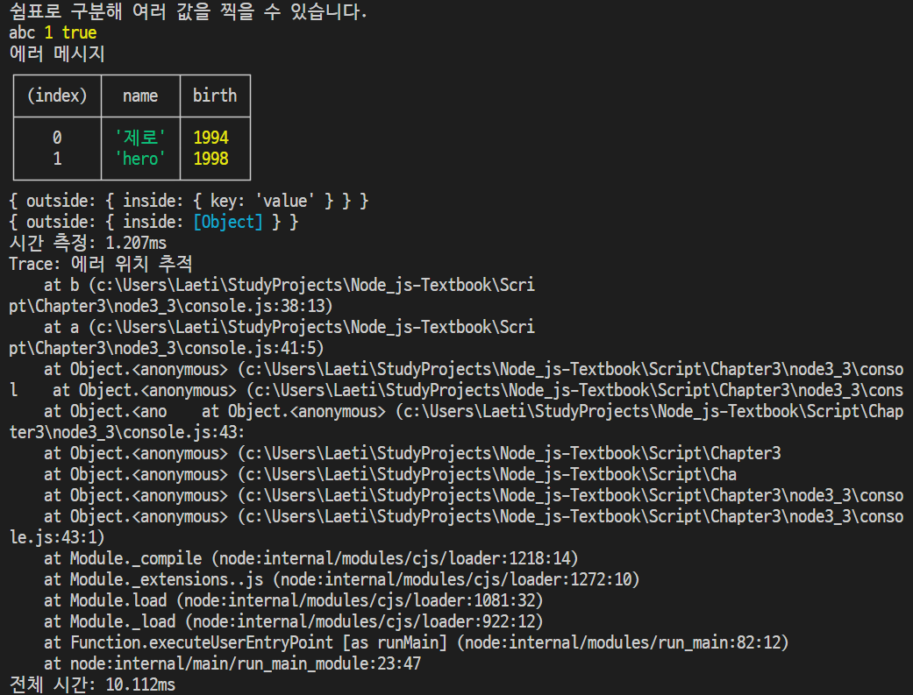

### REPL 사용하기
- READ(읽기) / EVAL(해석) / PRINT(반환) / LOOP(반복)
- 정보를 읽어 해석한 것을 출력하는 과정을 반복하는 것을 의미
- 미리 컴파일하지 않아도 콘솔을 통해 사용 가능함
### JS 파일 실행하기
```javascript
function helloWorld() {
    console.log('Hello World');
    helloNode();
}

function helloNode() {
    console.log('Hello Node');
}

helloWorld();
```
```
$ node helloWorld
Hello World
Hello Node
```

### 모듈 만들기
- 모듈 : 특정한 기능을 하는 함수나 변수들의 집합
  - 모듈을 만들어두면 필요한 기능의 코드를 재사용할 수 있음
- ES2015 모듈 : 자체 모듈 시스템 문법
  - require -> import / module.exports -> export default
  - 파일 확장자를 mjs로 바꾸거나 package.json에 type: "module" 속성을 넣어야함
- var.js
```javascript
const odd = '홀수';
const even = '짝수';

// 파일 불러오면 export default(module.exports)에 대입된 값 사용
export default {
    odd,
    even,
};
```

- func.js
```javascript
// const { odd, even } = require('./var');
import { odd, even } from './var.mjs';

function checkOddOrEven(num) {
    if(num % 2) {
        return odd;
    }
    return even;
}

export default checkOddOrEven;
```

- index.js
```javascript
import { odd, even } from './var.mjs';
import checkNumber from './func.mjs';

function checkStringOddOrEven(str) {
    if (str.length % 2) {
        return odd;
    }
    return even;
}

console.log(checkNumber(10));
console.log(checkStringOddOrEven('Hello'));
```

### 노드 내장 객체 알아보기
##### global
- 브라우저의 window와 같은 전역 객체
- 모든 파일에서 접근 가능
- window.open(window.console)을 open(console)으로 호출하는 것 처럼 global도 생략 가능
```javascript
$ node
> global
{
    global: [Circular *1],
    clearInterval: [Function: clearInterval]
    clearTimeout: [Function: clearTimeout]
    ...
}
> global.console
{
    log: [Function: bound consoleCall],
    warn: [Function: bound consoleCall],
    dir: [Function: bound consoleCall],
    ...
}
```

```javascript
import A from './globalA.mjs';

global.message = '안녕하세요';
console.log(A());
```

```javascript
export default () => global.message;
```

```
$ node globalB
안녕하세요
```

##### console
- 디버깅을 위해 사용
- console.time(레이블) / console.timeEnd(레이블) : 서로 대응되며, 같은 레이블을 가진 time과 timeEnd 사이 시간 측정
- console.log(내용) : 로그들을 콘솔에 표시
- console.error(에러 내용) : 에러를 콘솔에 표시
- console.table(배열) : 배열 요소로 객체 리터럴을 넣으면 객체 속성들이 테이블 형식으로 표현
- console.dir(객체, 옵션) : 객체를 콘솔에 표시할 떄 사용
  - 첫 번째 인수 : 표시할 객체
  - 두 번째 인수 : 옵션
    - colors : 경우 true로 할 경우 콘솔에 색이 추가
    - depth : 객체 안의 객체를 몇 단계까지 보여줄 지 결정(기본값 : 2)
- console.trace(레이블) : 에러가 어디서 발생했는지 추적
```javascript
const string = 'abc';
const number = 1;
const boolean = true;
const obj = {
    outside: {
        inside: {
            key: 'value'
        },
    },
};
console.time('전체 시간');
console.log('쉼표로 구분해 여러 값을 찍을 수 있습니다.');
console.log(string, number, boolean);
console.error('에러 메시지');

console.table([{
    name: '제로',
    birth: 1994
}, {
    name: 'hero',
    birth: 1998
}]);

console.dir(obj, {
    colors: false,
    depth: 2,
});
console.dir(obj, {
    colors: true,
    depth: 1,
});

console.time('시간 측정');
for (let i = 0; i < 100000; i++) { }
console.timeEnd('시간 측정');

function b() {
    console.trace('에러 위치 추적');
}
function a() {
    b();
}
a();

console.timeEnd('전체 시간');
```


##### 타이머
- setTimeout(콜백 함수, 밀리초) : 주어진 밀리초 이후에 콜백 함수 실행
- setInterval(콜백 함수, 밀리초) : 주어진 밀리초마다 콜백 함수 반복 실행
- setImmediate(콜백 함수) : 콜백 함수 즉시 실행
- clearTimeout(아이디) : setTimeout을 취소
- clearInterval(아이디) : setInterval을 취소
- clearImmediate(아이디) : setImmediate를 취소
```javascript
const timeout = setTimeout(() => {
    console.log('1.5초 후 실행');
}, 1500);

const interval = setInterval(() => {
    console.log('1초마다 실행');
}, 1000);

const timeout2 = setTimeout(() => {
    console.log('실행되지 않습니다.');
}, 3000);

setTimeout(() => {
    clearTimeout(timeout2);
    clearInterval(interval);
}, 2500);

const immediate = setImmediate(() => {
    console.log('즉시 실행');
});

const immediate2 = setImmediate(() => {
    console.log('실행되지 않습니다.');
});

clearImmediate(immediate2);
```
```
즉시 실행
1초마다 실행
1.5초 후 실행
1초마다 실행
```

##### __filename, __dirname
- 현재 파일명과 파일 경로에 대한 정보 확인 가능
```javascript
console.log(__filename);
console.log(__dirname);
```
```
c:\Users\Laeti\StudyProjects\Node_js-Textbook\Script\Chapter3\node3_4\filename.js
c:\Users\Laeti\StudyProjects\Node_js-Textbook\Script\Chapter3\node3_4
```

##### module, exports, require
- 모듈을 만드는 객체
> - this 특징
>   - 최상위 스코프에 존재하는 this는 module.exports를 가리킴
>   - 함수 선언문 내부 this는 global 객체를 가리킴
>     ```javascript
>     console.log(this);
>     console.log(this === module.exports);
>     console.log(this === exports);
> 
>     function whatIsThis() {
>         console.log('function', this === exports, this === global);
>     }
> 
>     whatIsThis();
>     ```
>     ```
>     {}
>     true
>     true
>     function false true
>     ```

- require
  - cache
    - 파일에 대한 속성이나 모듈 관계 등 cache 정보 확인
    - 한 번 require한 파일은 require.cache에 저장
    - 새로 require할 경우 require.cache의 속성을 제거해야 함
  - main : 노드 실행 시 첫 모듈을 가리킴
      ```javascript
      console.log("require가 가장 위에 올 필요가 없습니다.");
      module.expports = "저를 찾아보세요.";

      require('./var');

      console.log('require.cache입니다.');
      console.log(require.cache); // 파일명에 대한 정보 출력
      console.log('require.main입니다.');
      console.log(require.main === module); // 현재 파일이 첫 모듈인지 확인
      console.log(require.main.filename); // 첫 모듈 파일명 확인
      ```
- 순환 참조가 있을 경우 대상을 빈 객체로 표시
  - dep1.js
  ```javascript
  const dep2 = require('./dep2');
  console.log('require dep2', dep2);
  module.exports = () => {
      console.log('dep2', dep2);
  };
  ```
  - dep2.js
  ```javascript
  const dep1 = require('./dep1');
  console.log('require dep1', dep1);
  module.exports = () => {
  console.log('dep1', dep1);
  };
  ```
  dep-run.js
  ```javascript
  const dep1 = require('./dep1');
  const dep2 = require('./dep2');

  dep1();
  dep2();
  ```
```
require dep1 {}
require dep2 [Function (anonymous)]
dep2 [Function (anonymous)]
dep1 {}
```
##### process
- 현재 실행되고 있는 노드 프로세스에 대한 정보를 담고 있음
- process.version : 설치된 노드 버전 확인
- process.arch : 프로세서 아키텍처 정보 (arm, ia32 등의 값)
- process.platform : 운영체제 플랫폼, linux나 darwin, freebsd 등의 값
- process.pid : 현재 프로세스 아이디, 프로세스 여러 개를 가질 때 구분할 수 있음
- process.uptime() : 프로세스가 시작된 후 흐른 시간, 초단위로 진행
- process.exePath : 노드의 경로
- process.cwd() : 현재 프로세스가 실행되는 위치
- process.cpuUsage : 현재 cpu 사용량

- process.env : 시스템 환경 변수

- process.nextTick(콜백) : 이벤트 루프가 다른 콜백 함수들보다 nextTick의 콜백 함수를 우선으로 처리하도록 만듦
  - process.nextTick와 Promise를 마이크로태스크(microtask)라 부름
  - 이벤트 루프는 마이크로태스크를 우선하기 때문에 재귀 호출은 다른 콜백 함수들이 실행되지 않을 수 있음
   
```javascript
setImmediate(() => {
    console.log('immediate');
});
process.nextTick(() => {
    console.log('nextTick');
});
setTimeout(() => {
    console.log('timeout');
}, 0);
Promise.resolve().then(() => console.log('promise'));
```
```
$ node nextTick
nextTick
promise
timeout
immediate
```

##### process.exit(노드 프로세스)
- 실행중인 노드 프로세스 종료
```javascript
let i = 1;
setInterval(() => {
    if (i === 5) { // i가 5가 되었을 때 종료
        console.log('종료!');
        process.exit();
    }
    console.log(i);
    i += 1;
}, 1000);
```

### 노드 내장 모듈
##### os
- 사용자 컴퓨터의 운영체제 정보를 가져옴
- os.arch() : process.arch와 동일, 프로세서 아키텍처 정보 (arm, ia32 등의 값)
- os.platform() : process.platform과 동일, 운영체제 플랫폼, linux나 darwin, freebsd 등의 값
- os.type() : 운영체제의 종류
- os.uptime() : 운영체제 부팅 이후 흐른 시간(초), 노드의 실행 시간
- os.hostname() : 컴퓨터의 이름
- os.release() : 운영체제 버전
- 경로
- os.homedir() : 홈 디렉터리 경로
- os.tmpdir() : 임시 파일 저장 경로
- CPU 정보
- os.cpus() : 컴퓨터의 코어 정보
- os.freemem() : 사용 가능한 메모리(RAM)
- os.totalmem() : 전체 메모리 용량

##### path
- 폴더와 파일의 경로를 쉽게 조작하도록 도와주는 모듈
- path.sep : 경로의 구분자, 윈도 : \로 경로 구분, POSIX : /로 경로 구분
- path.delimiter : 환경 변수의 구분자
- path.dirname(경로) : 파일이 위치한 폴더 경로
- path.extname(경로) : 파일의 확장자
- path.basename(경로, 확장자) : 파일의 이름과 확장자를 표시, 확장자 인수값을 넣을 시 파일 이름만 표시
- path.parse(경로) : 파일 경로를 root, dir, base, ext, name으로 분리
- path.format(객체) : path.parse()한 객체를 파일 경로로 합침
- path.normalize(경로) : /나 \를 실수로 여러번 사용하거나 혼용한 경우 정상적인 경로롤 변환
- path.isAbsolute(경로) : 파일의 경로가 절대경로인지 상대경로인지를 true나 false로 알림
- path.relative(기준경로, 비교경로) : 경로를 두 개 넣으면 첫 번째 경로에서 두 번째 경로로 가는 방법을 알려줌
- path.join(경로, ...) : 여러 인수를 넣으면 하나의 경로로 합침 상대경로인 ..(부모 디렉터리)과 .(현 위치)도 알아서 처리
- path.resolve(경로, ...) : path.join()과 다르게 절대경로로 인식하여 앞의 경로 무시
  - path.join('/a', '/b'. '/c'); /* 결과 : /a/b/c/ */
  - path.resolve('/a', '/b', 'c'); /* 결과 : /b/c */

##### url
- 인터넷 주소를 쉽게 조작하도록 도와주는 모듈
- 노드 버전 7에서 추가된 WHATWG(웹 표준 단체) 방식 url과 예전 노드에서 사용한 방식 url이 존재
- url.parse(주소) : 주소를 분해, WHATWG 방식과 비교하면 username과 password 대신 auth 속성이 있고, searchParams 대신 query가 있음
- url.format(객체) : WHATWG 방식 url과 기존 노드의 url을 모두 사용할 수 있음
```javascript
const url = require('url'); // WHATWG 방식 url

// 기존 방식 url
const { URL } = url;
const myURL = new URL('http://www.gilbut.co.kr/book/bookList.aspx?sercate1=001001000#anchor');
console.log('new URL():', myURL);
console.log('url.format():', url.format(myURL));
```
```
new URL(): URL {
  href: 'http://www.gilbut.co.kr/book/bookList.aspx?sercate1=001001000#anchor',
  origin: 'http://www.gilbut.co.kr',
  protocol: 'http:',
  username: '',
  password: '',
  host: 'www.gilbut.co.kr',
  hostname: 'www.gilbut.co.kr',
  port: '',
  pathname: '/book/bookList.aspx',
  search: '?sercate1=001001000',
  searchParams: URLSearchParams { 'sercate1' => '001001000' },
  hash: '#anchor'
}
url.format(): http://www.gilbut.co.kr/book/bookList.aspx?sercate1=001001000#anchor
```
- searchParams 객체 : WHATWG 방식에서 반환되는 객체
  - search는 주소를 통해 데이터 전달할 때 사용, 물음표(?)로 시작해 그 뒤에 키=값 형식으로 데이터 전달, 여러 키인 경우 &로 구분
```javascript
const myURL = new URL('http://www.gilbut.co.kr/?page=3&limit=10&category=nodejs&category=javascript');
console.log('searchParams:', myURL.searchParams);
console.log('searchParams.getAll():', myURL.searchParams.getAll('category'));
console.log('searchParams.get():', myURL.searchParams.get('limit'));
console.log('searchParams.has():', myURL.searchParams.has('page'));

console.log('searchParams.keys():', myURL.searchParams.keys());
console.log('searchParams.values():', myURL.searchParams.values());

myURL.searchParams.append('filter', 'es3');
myURL.searchParams.append('filter', 'es5');
console.log(myURL.searchParams.getAll('filter'));

myURL.searchParams.set('filter', 'es6');
console.log(myURL.searchParams.getAll('filter'));

myURL.searchParams.delete('filter');
console.log(myURL.searchParams.getAll('filter'));

console.log('searchParams.toString():', myURL.searchParams.toString());
myURL.search = myURL.searchParams.toString();
```
```
searchParams: URLSearchParams {
  'page' => '3',
  'limit' => '10',
  'category' => 'nodejs',
  'category' => 'javascript' }
searchParams.getAll(): [ 'nodejs', 'javascript' ]
searchParams.get(): 10
searchParams.has(): true
searchParams.keys(): URLSearchParams Iterator { 'page', 'limit', 'category', 'category' }
searchParams.values(): URLSearchParams Iterator { '3', '10', 'nodejs', 'javascript' }
[ 'es3', 'es5' ]
[ 'es6' ]
[]
searchParams.toString(): page=3&limit=10&category=nodejs&category=javascript
```

##### 객체 조작 메서드
- getAll(키) : 키에 해당하는 모든 값들을 가져옴
- get(키) : 키에 해당하는 첫 번째 값만 가져옴
- has(키) : 해당 키가 있는지 없는지 검사
- keys() : searchParams의 모든 키를 반복기(iterator) 객체로 가져옴
- values() : searchParams의 모든 값을 반복기 객체로 가져옴
- append(키, 값) : 키를 추가, 같은 값의 키가 있으면 유지하고 하나 더 추가
- set(키, 값) : 같은 값 키를 모두 지우고 새로 추가
- delete(키) : 해당 키 제거
- toString() : 조작한 searchParams 객체를 다시 문자열로 만듦, search에 대입하면 주소 객체에 반영

##### querystring
- 기존 방식 url을 사용할 때, search부분을 사용하기 쉽게 객체로 만드는 모듈
- querystring.parse(쿼리) : url query 부분을 자바스크립트 객체로 분해
- querystring.stringify(객체) : 분해된 query 객체를 문자열로 다시 조립
```javascript
const url = require('url');
const querystring = require('querystring');

const parsedUrl = url.parse("http://www.gilbut.co.kr/?page=3&limit=10&category=nodejs&category=javascript");
const query = querystring.parse(parsedUrl.query);
console.log('querystring.parse() : ', query);
console.log('querystring.stringify() : ', querystring.stringify(query));
```
```
querystring.parse() :  [Object: null prototype] {
  page: '3',
  limit: '10',
  category: [ 'nodejs', 'javascript' ]
}
querystring.stringify() :  page=3&limit=10&category=nodejs&category=javascript
```

##### crypto
- 다양한 방식의 암호화를 도와주는 모듈
- 단방향 암호화 : 비밀번호에 사용하는 암호화, 복호화할 수 없는 암호화 방식을 의미. 해시 기법을 주로 사용
  - 해시 기법 : 어떠한 문자열을 고정된 길이의 다른 문자열로 바꿔버리는 방식
  
    - createHash(알고리즘) : 사용할 해시 알고리즘을 넣음, md5와 sha1은 이미 취약점이 발견
    - update(문자열) : 변환할 문자열을 넣음
    - digest(인코딩) : 인코딩할 알고리즘을 넣음, base64, hex, latin1 등이 있음
  ```javascript
  const crypto = require('crypto');

  console.log('base64:', crypto.createHash('sha512').update('비밀번호').digest('base64'));
  console.log('hex:', crypto.createHash('sha512').update('비밀번호').digest('hex'));
  console.log('base64:', crypto.createHash('sha512').update('다른 비밀번호').digest('base64'));
  ```
  ```
  base64: dvfV6nyLRRt3NxKSlTHOkkEGgqW2HRtfu19Ou/psUXvwlebbXCboxIPmDYOFRIpqav2eUTBFuHaZri5x+usy1g==
  hex: 76f7d5ea7c8b451b773712929531ce92410682a5b61d1b5fbb5f4ebbfa6c517bf095e6db5c26e8c483e60d8385448a6a6afd9e513045b87699ae2e71faeb32d6
  base64: cx49cjC8ctKtMzwJGBY853itZeb6qxzXGvuUJkbWTGn5VXAFbAwXGEOxU2Qksoj+aM2GWPhc1O7mmkyohXMsQw==
  ```

  - pbkdf2 : 기존 문자열에 salt라고 불리는 문자열을 붙인 후 해시 알고리즘을 반복해서 적용
  
  ```javascript
  const crypto = require('crypto');

  crypto.randomBytes(64, (err, buf) => {
    const salt = buf.toString('base64');
    console.log('salt:', salt);
    crypto.pbkdf2('비밀번호', salt, 100000, 64, 'sha512', (err, key) => { // 알고리즘 10만회 반복해서 적용
      console.log('password:', key.toString('base64'));
    });
  });
  ```
  ```
  salt: nt/WvMfQuxy87m3G6yGZvuyamTvmhmx54ME5ns7YZq38Gq1UHkULcOKpmzyiL+49wAOuVZXQIN2THidlJl3U3w==
  password: PAtnwM8inzx5PxmOCDv78bYnQEx9K4dd9O8AbL9AYViTYfBG6J5EjeOaNsAdr/6YTEwjtD93n2p9jIuW9b0kew==
  ```
- 양방향 암호화 : 키를 통해 암호화된 문자열을 복호화할 수 있음
```javascript
const crypto = require('crypto');

const algorithm = 'aes-256-cbc';
const key = 'abcdefghijklmnopqrstuvwxyz123456';
const iv = '1234567890123456';

const cipher = crypto.createCipheriv(algorithm, key, iv);
let result = cipher.update('암호화할 문장', 'utf8', 'base64');
result += cipher.final('base64');
console.log('암호화:', result);

const decipher = crypto.createDecipheriv(algorithm, key, iv);
let result2 = decipher.update(result, 'base64', 'utf8');
result2 += decipher.final('utf8');
console.log('복호화:', result2);
```
```
암호화: iiopeG2GsYlk6ccoBoFvEH2EBDMWv1kK9bNuDjYxiN0=
복호화: 암호화할 문장
```

##### util
- 각종 편의 기능을 모아둔 모듈
- util.deprecate : deprecate 처리된 함수임을 알림
- util.promisify : 콜백 패턴을 프로미스 패턴으로 바꿈
```javascript
const util = require('util');
const crypto = require('crypto');

const dontUseMe = util.deprecate((x, y) => {
  console.log(x + y);
}, 'dontUseMe 함수는 deprecated되었으니 더 이상 사용하지 마세요!');
dontUseMe(1, 2);

const randomBytesPromise = util.promisify(crypto.randomBytes);
randomBytesPromise(64)
  .then((buf) => {
    console.log(buf.toString('base64'));
  })
  .catch((error) => {
    console.error(error);
  });

```
```
3
(node:96184) DeprecationWarning: dontUseMe 함수는 deprecated되었으니 더 이상 사용하지 마세요!
(Use `node --trace-deprecation ...` to show where the warning was created)
aBVbBkVkNuz/uHCxXp3H2j5k6mLpVN1HktwUK3WYykU48ZfiOaA7/r+OyJuoUxU21VosJRDzRz/iLciq1SAg3w==
```

##### worker_threads : 노드에서 멀티 스레드 방식으로 작업
```javascript
const {
  Worker, isMainThread, parentPort,
} = require('worker_threads');

// 메인 스레드에서 실행되는지 생성한 워커 스레드에 실행되는지 구분
if (isMainThread) { // 부모일 때
  const worker = new Worker(__filename);
  worker.on('message', message => console.log('from worker', message));
  worker.on('exit', () => console.log('worker exit'));
  worker.postMessage('ping');
} else { // 워커일 때
  parentPort.on('message', (value) => {
    console.log('from parent', value);
    parentPort.postMessage('pong');
    parentPort.close();
  });
}
```
```
from parent ping
from worker pong
worker exit
```

##### child_process
- 노드에서 다른 프로그램을 실행하고 싶거나 명령어를 수행하고 싶을 때 사용하는 모듈
- 다른 언어 코드를 실행하고 결과값을 받을 수 있음
- 현재 노드 프로세스 외 새로운 프로세스를 띄워 명령을 수행하고 노드 프로세스에 결과를 알려줄 수 있음
```javascript
const exec = require('child_process').exec;

const process = exec('dir');

process.stdout.on('data', function(data) {
  console.log(data.toString());
}); // 실행 결과javascript

process.stderr.on('data', function(data) {
  console.error(data.toString());
}); // 실행 에러
```
```
2022-12-15  ���� 03:55    <DIR>          .
2022-12-14  ���� 08:32    <DIR>          ..
2022-12-29  ���� 11:20    <DIR>          Image
2022-12-29  ���� 11:20    <DIR>          Markdown
2022-12-15  ���� 01:49    <DIR>          Script
               0�� ����                   0 ����Ʈ
               5�� ���͸�  250,540,572,672 ����Ʈ ����
```

##### 기타 모듈
- assert : 값을 비교하여 프로그램이 제대로 동작하는지 테스트
- dns : 도메인 이름에 대한 IP 주소를 얻어냄
- net : HTTP보다 로우 레벨인 TCP나 IPC 통신을 할 때 사용
- string_decoder : 버퍼 데이터를 문자열로 바꾸는 데 사용
- tls : TLS와 SSL에 관련한 작업을 할 때 사용
- tty : 터미널과 관련된 작업을 할 때 사용
- dgram : UDP와 관련된 작업을 할 때 사용
- v8 : V8 엔진에 직접 접근할 때 사용
- vm : 가상 머신에 직접 접근할 때 사용

### 파일 시스템 접근
- fs 모듈 : 파일 시스템에 접근하는 모듈
```javascript
const fs = require('fs');

// read a file
fs.readFile('./Script/Chapter3/node3_5/readme.txt', (err, data) => {
    if (err) {
        throw err;
    }
    console.log(data); // 버퍼(Buffer)
    console.log(data.toString()); // 버퍼 문자열 반환
});
```
- 콜백 형식의 모듈이기 때문에 실무에서 사용하기 위해서는 프로미스 형식으로 작성
```javascript
const fs = require('fs').promises;

// read a file, promises
fs.readFile('./Script/Chapter3/node3_5/readme.txt')
    .then((data) => {
        console.log(data);
        console.log(data.toString());
    })
    .catch((err) => {
        console.error(err);
    });
```
```javascript
const fs = require('fs').promises;

// write a file
fs.writeFile('./Script/Chapter3/node3_5/writeme.txt', "글을 작성했습니다.")
    .then(() => { // 작성된 파일 읽기
        return fs.readFile('./Script/Chapter3/node3_5/writeme.txt');
    })
    .then((data) => {
        console.log(data.toString());
    })
    .catch((err) => {
        console.error(err);
    });
```

#### 동기 메서드와 비동기 메서드
- fs 모듈이 동기 방식으로 처리 하는 메서드를 많이 가지고 있음
```javascript
const fs = require('fs');

console.log('시작');

// 비동기 - 논블로킹 방식

fs.readFile('./Script/Chapter3/node3_5/readme.txt', (err, data) => {
    if (err) {
        throw err;
    }
    console.log('1번', data.toString());
});
fs.readFile('./Script/Chapter3/node3_5/readme.txt', (err, data) => {
    if (err) {
        throw err;
    }
    console.log('2번', data.toString());
});
fs.readFile('./Script/Chapter3/node3_5/readme.txt', (err, data) => {
    if (err) {
        throw err;
    }
    console.log('3번', data.toString());
});
console.log('끝');
```
```
시작
끝
1번 안녕하세요.
3번 안녕하세요.
2번 안녕하세요.
```
```javascript
const fs = require('fs');

// 비동기방식으로 순서 유지

console.log('시작');

fs.readFile('./Script/Chapter3/node3_5/readme.txt', (err, data) => {
    if (err) {
        throw err;
    }
    console.log('1번', data.toString());
    fs.readFile('./Script/Chapter3/node3_5/readme.txt', (err, data) => {
        if (err) {
            throw err;
        }
        console.log('2번', data.toString());
        fs.readFile('./Script/Chapter3/node3_5/readme.txt', (err, data) => {
            if (err) {
                throw err;
            }
            console.log('3번', data.toString());
            console.log('끝');
        });
    });
});
```

- readFileSync 메서드를 사용할 시 많은 요청이 들어올 때 성능에 문제가 생길 수 있음
- 동기 메서드들은 이름 뒤에 Sync가 붙어있음(writeFileSync, readFileSync 등)
```javascript
const fs = require('fs');

// 동기-블로킹 방식, 순서대로 출력
console.log('시작');
let data = fs.readFileSync('./Script/Chapter3/node3_5/readme.txt');
console.log('1번', data.toString());
data = fs.readFileSync('./Script/Chapter3/node3_5/readme.txt');
console.log('2번', data.toString());
data = fs.readFileSync('./Script/Chapter3/node3_5/readme.txt');
console.log('3번', data.toString());
console.log('끝');
```
```javascript
const fs = require('fs');

// 콜백 지옥에 대한 Promise async/await 해결
console.log('시작');

fs.readFile('./Script/Chapter3/node3_5/readme.txt')
    .then((data) => {
        console.log('1번', data.toString());
        return fs.readFile('./Script/Chapter3/node3_5/readme.txt');
    })
    .then((data) => {
        console.log('2번', data.toString());
        return fs.readFile('./Script/Chapter3/node3_5/readme.txt');
    })
    .then((data) => {
        console.log('3번', data.toString());
        console.log('끝');
    }).catch((err) => {
        console.error(err);
    });
```

##### 버퍼와 스트림 이해하기
- 노드에서 파일을 읽을 때 메모리에 파일 크기만큼 Buffer에 저장하고 데이터 전송
- from(문자열) : 문자열을 버퍼로 변경
- toString(버퍼) : 버퍼를 다시 문자열로 변경, base64나 hex를 인수로 넣으면 해당 인코딩으로 변경 가능
- concat(배열) : 배열 안에 든 버퍼들을 하나로 합침
- alloc(바이트) : 빈 버퍼 생성, 바이트를 인수로 넣으면 해당 크기의 버퍼 생성
```javascript
const buffer = Buffer.from('저를 버퍼로 바꾸십시오.');
console.log('from() : ', buffer);
console.log('length : ', buffer.length);
console.log('toString() : ', buffer.toString());

const array = [Buffer.from('띄엄 '), Buffer.from('띄엄 '), Buffer.from('띄어쓰기')];
const buffer2 = Buffer.concat(array);
console.log('concat() : ', buffer2.toString());

const buffer3 = Buffer.alloc(5);
console.log('alloc() : ', buffer3);
```
```
from() :  <Buffer ec a0 80 eb a5 bc 20 eb b2 84 ed 8d bc eb a1 9c 20 eb b0 94 ea be b8 ec 8b ad ec 8b 9c ec 98 a4 2e>
length :  33
toString() :  저를 버퍼로 바꾸십시오.
concat() :  띄엄 띄엄 띄어쓰기
alloc() :  <Buffer 00 00 00 00 00>
```

- Stream : 버퍼의 크기를 작게 만든 후 여러 번 나눠 보낼 수 있음
  - readFile 방식 사용 시 용량이 커질 경우 메모리 문제를 대비
- createReadStream(읽을 파일 경로, 옵션) : 읽기 스트림 생성
  - highWaterMark : 버퍼의 크기(바이트 단위)를 정할 수 있는 옵션(기본값 : 64KB)
- readStream : 스트림 정보를 읽으며, 이벤트 리스너를 붙여서 사용(data, end, error)
```javascript
const fs = require('fs');

const readStream = fs.createReadStream('./Script/Chapter3/node3_5/readme2.txt', {
    highWaterMark: 16
});
const data = [];

// 파일 읽기가 시작되면 data 이벤트 리스너
readStream.on('data', (chunk) => {
    data.push(chunk);
    console.log('data : ', chunk, chunk.length);
});

// 파일을 다 읽으면 end 이벤트 리스너
readStream.on('end', () => {
    console.log('end : ', Buffer.concat(data).toString()); // 버퍼들을 모두 합쳐 문자열로 출력
});

readStream.on('error', (err) => {
    console.log('error : ', err);
});
```
```
data :  <Buffer ec 95 88 eb 85 95 20 eb 82 98 eb 8a 94 20 eb b0> 16
data :  <Buffer 95 eb 8f 99 ed 9b 88 ec 9d b4 eb 9d bc ea b3 a0> 16
data :  <Buffer 20 ed 95 9c eb 8b a4 2e 20 eb a7 8c eb 82 98 ec> 16
data :  <Buffer 84 9c 20 eb b0 98 ea b0 91 eb 8b a4 2e> 13
end :  안녕 나는 박동훈이라고 한다. 만나서 반갑다.
```

- createWriteStream(출력 파일명) : 쓰기 스트림 생성
- writeStream : 스트림 정보를 쓰며, 이벤트 리스너를 붙여서 사용(finish)
```javascript
const fs = require('fs');

const writeStream = fs.createWriteStream('./writeme2.txt');
writeStream.on('finish', () => { // 파일 작성 시 finish 이벤트 리스너
    console.log('파일 쓰기 완료'); 
});

writeStream.write('나는 글을 쓴다.');
writeStream.write('나는 뇌절 쓴다.');
writeStream.end();
```

- pipe : 스트림끼리 연결, 파일을 전달할 수 있으며 여러 번 연결 가능
```javascript
const fs = require('fs');

const readStream = fs.createReadStream('readme.txt');
const writeStream = fs.createWriteStream('writeme3.txt');
readStream.pipe(writeStream); // readStream 내용의 writeStream 연결
```

##### 기타 fs 메서드
- fs.access(경로, 옵션, 콜백) : 폴더나 파일에 접근할 수 있는지 확인 
  - F_OK : 파일 존재 여부
  - R_OK : 읽기 권한 여부
  - W_OK : 쓰기 권한 여부
  - ENOENT : 파일/폴더 없을 때 에러 코드
- fs.mkdir(경로, 콜백) : 폴더를 만드는 메서드
- fs.open(경로, 옵션, 콜백) : 파일의 아이디(fd 변수)를 가져오는 메서드
  - w : 쓰기 옵션
  - r : 읽기 옵션
  - a : 기존 파일 추가 옵션
- fs.rename(기존 경로, 새 경로, 콜백) : 파일 이름 바꾸는 메서드
- fs.readdir(경로, 콜백) : 폴더 안의 내용물 확인
- fs.unlink(경로, 콜백) : 파일 삭제
- fs.rmdir(경로, 콜백) : 폴더 삭제
- fs.watch(경로) : 파일/폴더 변경 사항 감지

##### 스레드풀
- ??


### 이벤트
- 이벤트 만들기
- on(이벤트명, 콜백) : 이벤트 리스너, 해당 이름의 이벤트 발생 시 콜백 연결
- addListener(이벤트명, 콜백) : 이벤트 리스너 추가, on과 기능 동일
- emit(이벤트명) : 이벤트 호출 메서드
- once(이벤트명, 콜백) : 한 번만 실행되는 이벤트, 여러 번 호출해도 한 번만 실행됨
- removeAllListeners(이벤트명) : 이벤트에 연결된 모든 이벤트 리스너 제거
- removeListener(이벤트명, 리스너) : 이벤트에 연결된 리스너 하나씩 제거
- off(이벤트명, 콜백) : removeListener 기능과 동일
- listenerCount(이벤트명) : 현재 연결된 리스너 개수 확인
```javascript
const EventEmitter = require('events');

const myEvent = new EventEmitter();
myEvent.addListener('event1', () => {
  console.log('이벤트 1');
});
myEvent.on('event2', () => {
  console.log('이벤트 2');
});
myEvent.on('event2', () => {
  console.log('이벤트 2 추가');
});
myEvent.once('event3', () => {
  console.log('이벤트 3');
}); // 한 번만 실행됨

myEvent.emit('event1'); // 이벤트 호출
myEvent.emit('event2'); // 이벤트 호출

myEvent.emit('event3');
myEvent.emit('event3'); // 실행 안 됨

myEvent.on('event4', () => {
  console.log('이벤트 4');
});
myEvent.removeAllListeners('event4');
myEvent.emit('event4'); // 실행 안 됨

const listener = () => {
  console.log('이벤트 5');
};
myEvent.on('event5', listener);
myEvent.removeListener('event5', listener);
myEvent.emit('event5'); // 실행 안 됨

console.log(myEvent.listenerCount('event2'));
```

### 예외 처리
- node: command not found : 노드를 설치했지만 환경 변수가 제대로 설정되지 않은 문제
- ReferenceError: 모듈 is not a defined : 모듈이 제대로 require 되지 않음
- Error: Cannot find module 모듈명 : 해당 모듈을 require 했지만 설치하지 않음
- Error: Can't set headers after they are sent : 요청에 대한 응답을 보낼 때 응답을 두 번 이상 보낼 때 발생하는 오류, 요청에 대한 응답은 한 번만 보내야함
- FATAL ERROR: CALL_AND_RETRY_LAST Allocation failed - Javascript heap out of memory : 메모리가 부족해 스크립트가 정상적으로 작동되지 않음, 코드가 잘못되거나 메모리가 부족한 경우
- UnhandledPromiseRejectionWarning: Unhandled promise rejection : 프로미스 사용 시 catch 메서드를 붙이지 않았을 때 발생
- EADDRINUSE 포트 번호 : 해당 포트 번호에 이미 다른 프로세스가 연결되어 있음
- EACCES 또는 EPERM : 노드가 작업을 수행하는 데 권한이 충분하지 않음
- EJSONPARSE : package.json 등 JSON 파일에 문법 오류가 존재
- ECONNREFUSED : 요청을 보냈으나 연결이 성립되지 않을 경우 발생
- ETARGET : package.json에 기록한 패키지 버전이 존재하지 않을 때 발생
- ETIMEOUT : 요청을 보냈으나 응답이 일정 시간 내 오지 않을 경우 발생
- ENOENT : no such file or directory : 지정한 폴더나 파일이 존재하지 않는 경우 발생