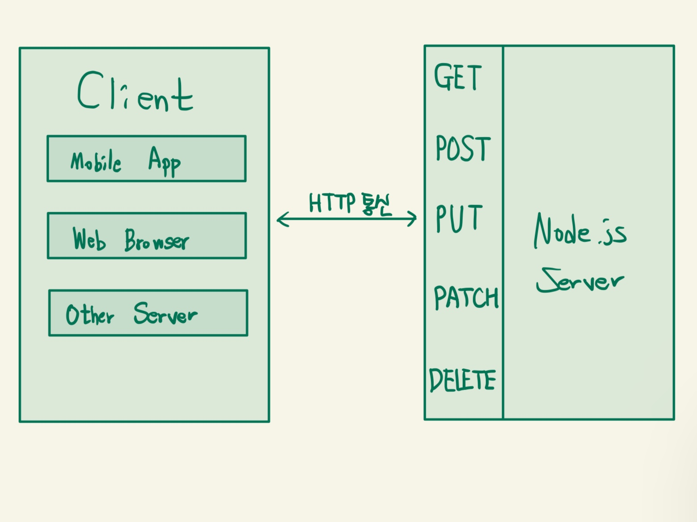
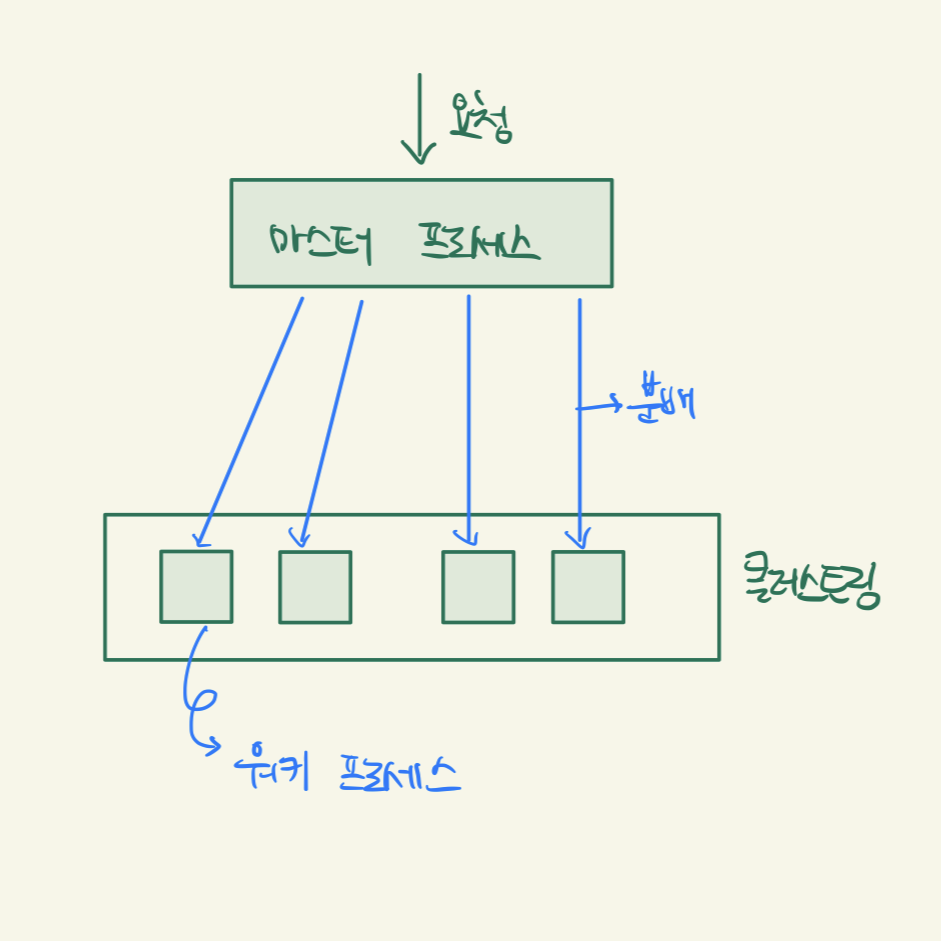

## 요청과 응답
- createServer : 인수로 요청한 콜백 함수를 실행할 수 있음
```javascript
const http = require('http');
http.createServer((req, res) => {
    // 이벤트 리스너 응답
    // req : 요청에 관한 정보
    // res : 응답에 관한 정보
});
```
- req : request(요청)
- res : response(응답)

- Javascript에 응답 정보 기록
```javascript
const http = require('http');
http.createServer((req, res) => {
    res.writeHead(200, { 'Content-Type': 'text/html; charset=utf-8' }); // 헤더(HEADER)
    res.write('<h1>Hello Node!</h1>'); // 본문(BODY)
    res.end('<p>Hello Server!</p>'); // 응답 종료 메서드
}).listen(8080, () => {
    console.log('8080 포트에서 서버 대기 중입니다.');
});
```

- HTML 파일을 만들고 fs 모듈로 읽기
  - HTTP 상태 코드
  > - 2XX : 성공을 알리는 상태 코드, 200(성공) / 201(작성됨)
  > - 3XX : 리다이렉션(다른 페이지로 이동)
  > - 4XX : 요청 오류, 요청 자체에 오류가 발생 시 표시
  > - 5XX : 서버 오류, 요청은 제대로 왔지만 서버에 오류 생긴 경우
```javascript
const http = require('http');
const fs = require('fs').promises;

http.createServer(async (req, res) => {
    try {
        const data = await fs.readFile('./Script/Chapter3/node3_5/server.html');
        res.writeHead(200, { 'Content-Type': 'text' });
        res.end(data);
    } catch (err) {
        console.error(err);
        res.writeHead(500, { 'Content-Type': 'text/plain; charset=utf-8' });
        res.end(err.message);
    }
}).listen(8080, () => {
    console.log('8080번 포트에서 서버 대기 중');
});
```

### REST와 라우팅 사용

- REST(REpresentation State Transfer) : 서버의 자원을 정의하고 자원에 대한 주소를 지정하는 방법
  - GET : 서버 자원을 가져오고자 할 때 사용하는 메서드
  - POST : 서버 자원을 새로 등록하고자 할 때 사용하는 메서드
  - PUT : 서버 자원을 요청에 들어 있는 자원으로 치환하는 메서드
  - PATCH : 서버 자원 일부만 수정할 때 사용하는 메서드
  - DELETE : 서버 자원을 삭제하고자 할 때 사용하는 메서드
  - OPTIONS : 요청을 하기 전에 통신 옵션을 설명하기 위해 사용하는 요청 메서드
- HTTP 주소 하나가 여러 개의 요청 메서드를 가질 수 있음
- HTTP 통신을 사용하면 클라이언트와 관계 없이 같은 방식으로 서버와 소통 가능
- RESTful 서버 : REST를 따르는 서버

### 쿠키와 세션
- 쿠키 : 웹 사이트 방문 시 저장되는 작은 기록 정보 파일
- 요청 헤더에 cookie를 통해 정보 확인
  - 쿠키명=쿠키값 : 기본적인 쿠키 값
  - Expires=날짜 : 만료 기한(기본값 : 클라이언트 종료될 때 까지)
  - Max-age=초 : 만료 기한, 날짜 대신 초를 입력하며 Expires보다 우선
  - Domain=도메인명 : 쿠키가 전송될 도메인을 특정(기본값 : 현재 도메인)
  - Path=URL : 쿠키가 전송될 URL 특정
  - Secure : HTTPS일 경우에만 쿠키 전송
  - HttpOnly : 자바스크립트에서 쿠키 접근할 수 없음
```javascript
const http = require('http');

http.createServer((req, res) => {
  console.log(req.url, req.headers.cookie);
  res.writeHead(200, { 'Set-Cookie': 'mycookie=test' }); // 브라우저에 쿠키 값 저장
  res.end('Hello Cookie');
})
  .listen(8083, () => {
    console.log('8083번 포트에서 서버 대기 중입니다!');
  });
```
- 세션 : 여러 페이지에 사용되는 정보 저장, 만료기간 또는 사용자가 브라우저를 닫아 서버와의 연결을 끝내는 시점
- 세션 쿠키 : 세션을 위해 사용하는 쿠키

### https와 http2
##### https 모듈
- 서버에 암호화를 적용할 수 있음
- 암호화할 수 있는 인증서가 필요하며 인증 기관에서 유/무료로 구할 수 있음

##### http2 모듈
- SSL 암호화와 동시에 최신 HTTP 프로토콜인 http/2를 사용할 수 있음
- 요청 응답 방식이 기존 http/1.1보다 개선되어 훨씬 효율적인 요청을 보내며 속도도 개선 가능

### cluster 모듈

- 싱글 프로세스로 동작하는 노드가 CPU 코어를 모두 사용할 수 있게 해주는 모듈
- 마스터 프로세스는 CPU 개수만큼 워커 프로세스를 만들고 요청이 들어오면 워커 프로세스에 분배
- cluster 모듈 뿐만 아니라 pm2 등의 모듈로도 클러스트링 기능 구현 가능