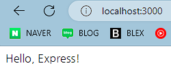

### Express(익스프레스)
- 편의 기능들을 추가한 웹 서버 프레임워크 중 하나
- http 모듈의 요청과 응답 객체에 추가 기능들이 부여됨
> npm i express // Express 설치  
> npm i -D nodemon // 서버를 자동으로 재시작 시켜주는 모듈

```javascript
const express = require('express');

const index = express();
index.set('port', process.env.PORT || 3000); // 서버가 실행될 포트 설정 process.env 객체에 PORT 속성이 없으면 3000번 포트 이용

index.get('/', (req, res) => { // 주소에 대한 GET 요청이 올 경우 어떤 동작을 할지 적는 부분
    res.send('Hello, Express!');
    // res.sendFile(path.join(__dirname, 'index.html')); // HTML로 응답
});

index.listen(index.get('port'), () => {
    console.log(index.get('port'), '번 포트에서 대기 중');
});
```


### Middleware(미들웨어)
- 운영체제와 응용 프로그램 또는 서버와 클라이언트 사이 다양한 서비스를 제공하는 소프트웨어
- Express의 핵심 기능으로 요청과 응답을 조작해 기능을 추가하거나 나쁜 요청을 걸러내는 역할
  - 애플리케이션에 요청 메소드와 주소에 따라 등록한 콜백 함수가 실행
  - `app.요청 메소드.\('URL', CALLBACK 함수(미들웨어))`
  - 요청 메소드 : get/post/put/delete/all/use
- 요청 메소드에 등록한 콜백 함수, 미들웨어는 next()로 연결할 수 있음
  - next('route')로 설정할 경우, 다음 라우터로 넘어가게 됨
  - 애플리케이션에는 에러 처리를 위한 미들웨어를 만드는 것을 권장
- app.use 형태로 사용
```javascript
app.use((req, res, next) => {
    console.log('모든 요청에서 다 실행됩니다.');
    next(); // 다음 미들웨어로 넘어가는 함수
});

app.get( // 주소에 대한 GET 요청이 올 경우 동작에 대한 미들웨어 정의
    // 라우터에 미들웨어를 여러 개 장착할 수 있음
    '/', // 주소
    (req, res, next) => { // 미들웨어 매개 변수
    console.log('GET / 요청에만 실행');
    next();
}, (req, res) => {
    throw new Error('에러 처리 미들웨어로 이동');
});

app.use((err, req, res, next) => { // 에러 처리 미들웨어
    console.error(err);
    res.status(500).send(err.message);
}); 
```
> **미들웨어 예시**  
> app.use(미들웨어) : 모든 요청에서 미들웨어 실행  
> app.use('/abc', 미들웨어) : abc로 시작하는 요청에서 미들웨어 실행  
> app.post('/abc', 미들웨어) : abc로 시작하는 POST 요청에서 미들웨어 실행

##### morgan
- 요청과 응답에 대한 정보를 확인할 수 있으며, 개발 환경에서 dev, 배포 환경에서 combine 사용
- `app.use(morgan('dev'))`
- dev 모드 출력 : [HTTP 메서드][주소][HTTP 상태 코드][응답 속도] - [응답 바이트]

##### static
- 정적인 파일들을 제공하는 라우터 역할
- `app.use('요청 경로', express.static('실제 경로')`
  - public/images/image.png 파일을 http://localhost:8080/images/image.png로 접근할 수 있음
- 외부인이 서버 구조를 쉽게 파악할 수 없으며, 보안에 도움이 됨

##### body-parser
- 요청의 본문에 있는 데이터를 해석해 req.body 객체를 만들어줌
- 폼 데이터나 AJAX 요청의 데이터를 처리하는 데 사용
- `app.use(bodyParser.raw())`

##### cookie-parser
- 요청에 있는 쿠키를 해석해 req.cookie 객체로 만듦
  - `app.use(cookieParser(비밀키))`
- 쿠키를 생성/제거하기 위해서는 메서드를 따로 사용해주어야함
  - res.cookie(쿠키 정보) : 쿠키 생성
  - res.clearCookie(쿠키 정보) : 쿠키 제거

##### express-session
- 세션 관리를 위한 미들웨어
- `app.use(session({세션 내용})`

### req, res 객체
- http 모듈의 req, res 객체를 확장한 것
- 메서드 체이닝을 활용하면 코드양을 줄일 수 있음

##### req
- req.app : req 객체를 통해 app 객체에 접근
- req.body : body-parser 미들웨어가 만드는 요청의 본문을 해석한 객체
- req.cookies : cookie-parser 미들웨어가 만드는 요청의 쿠키를 해석한 객체
- req.ip : 요청 ip 주소가 있음
- req.params : 라우트 매개변수에 대한 정보가 담긴 객체
- req.query : 쿼리스트링에 대한 정보가 담긴 객체
- req.signedCookies : 서명된 쿠키들은 req.cookies 대신 담겨있음
- req.get(헤더 이름) : 헤더의 값을 가져오고 싶을 때 사용

##### res
- res.app : req.app처럼 res 객체를 통해 app 객체에 접근
- res.cookie(키, 값, 옵션) : 쿠키 설정 메서드
- res.clearCookies(키, 값, 옵션) : 쿠키 제거 메서드
- res.end() : 데이터 없이 응답을 보냄
- res.json(JSON) : JSON 형식으로 응답을 보냄
- res.redirect(주소) : 리다이렉트할 주소와 함께 응답을 보냄
- res.render(뷰, 데이터) : 템플릿 엔진을 렌더링해서 응답할 때 사용
- res.send(데이터) : 데이터와 함께 응답을 보냄
- res.sendFile(경로) : 경로에 위치한 파일 응답
- res.set(헤더, 값) : 응답의 헤더 설정
- res.status(코드) : 응답 시 HTTP 상태 코드 지정